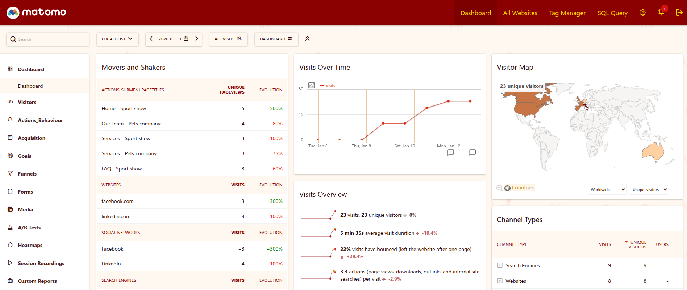

# Theme Chinese New Year

## Description

Celebrate the Lunar New Year with this festive Matomo theme. It transforms your analytics dashboard with a traditional Chinese red and gold color palette, a deep red header with gold navigation text, and a subtle tiled background featuring all twelve zodiac animals.

### Features

- **Red and gold color scheme** across the entire interface — header, sidebar, graphs, maps, and sparklines
- **Zodiac animal background** — a hand-drawn SVG pattern with all 12 Chinese zodiac animals (rat, ox, tiger, rabbit, dragon, snake, horse, goat, monkey, rooster, dog, pig) rendered as a subtle repeating tile
- **Custom graph palette** — 8 data series in Chinese red, imperial gold, deep crimson, lantern orange, goldenrod, firebrick, and tan gold
- **Themed visitor map** — red-to-gold gradient with gold highlights for selected countries
- **Clean card layout** — white content cards with warm shadows over the patterned background

### Screenshot

## Changelog

See [CHANGELOG.md](CHANGELOG.md).

## License

GPL-3.0+
